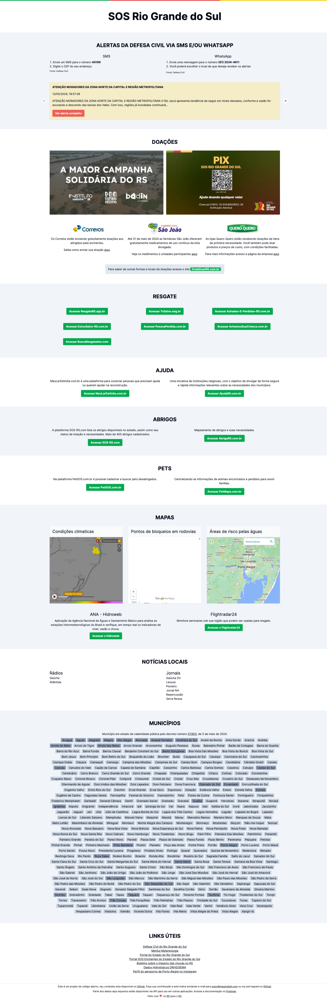

# SOS Rio Grande do SUl

> Informações úteis e catalogo de aplicações para ajudar o RS.

## Contribuindo

1. Crie um [fork](https://github.com/magnobiet/sos-rs/fork) do projeto
2. Crie sua _branch_
   - `git checkout -b feature/my-new-feature`
3. Faça o _commit_ das suas alterações
   - `git commit -m "feat: add some feature"`
4. Faça o _push_ da sua _branch_
   - `git push origin feature/my-new-feature`
5. Envie seu [_pull request_](https://github.com/magnobiet/sos-rs/pulls)

## Vulnerabilidades de segurança

Se você descobrir uma vulnerabilidade de segurança dentro deste projeto, envie um e-mail para Magno Biét via [magno.biet@gmail.com](mailto:magno.biet@gmail.com). Todas as vulnerabilidades de segurança serão abordadas prontamente.

## Licença

Este projeto está licenciado sob a [Licença MIT](https://license.magnobiet.com/mit/2024). Copyright © Magno Biét.
